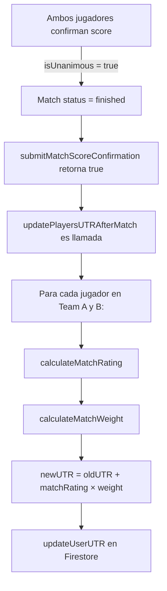

# UTR Algorithm Implementation

## Descripción General

El algoritmo UTR (Universal Tennis Rating) es un sistema de ranking dinámico que ajusta la calificación de un jugador después de cada partido competitivo. Este documento explica la implementación técnica del algoritmo para desarrolladores.

## Conceptos Clave (Sin Tenis)

Piensa en el sistema como un **rating dinámico** donde:
- Cada jugador tiene un **número de rating** (UTR)
- Al terminar un partido, el rating se ajusta basado en:
  - **Expectativa**: ¿Qué se esperaba que pasara según los ratings?
  - **Realidad**: ¿Qué pasó realmente?
  - **Peso**: ¿Cuánto "cuenta" este partido en el promedio final?

## Cálculo del Rating (3 Pasos)

### 1. Match Rating: ¿Cuánto cambias por ESTE partido?

Se calcula comparando **expectativa vs realidad**:

```
Expectativa = calculateExpectedWinPercentage(myUTR, opponentUTR)
              // Usa sigmoide: 1 / (1 + e^(-(diff/0.4)))

Realidad = gamesWon / totalGames

MatchRating = (Realidad - Expectativa) × 0.5
              // Rango típico: -0.50 a +0.50 puntos
```

**Ejemplos:**
- Ganas contra alguien más fuerte de lo esperado → +0.30 puntos
- Pierdes contra alguien más débil de lo esperado → -0.40 puntos
- Resultado exacto como se esperaba → ~0.00 puntos

### 2. Match Weight: ¿Cuánto "pesa" este partido?

Cuatro factores influyen en el peso (multiplicador entre 0.3 y 1.0):

#### a) Formato (Format Weight)
- **Ranking** (best of 3+ sets): 1.0
- **Friendly** (8-game pro set): 0.7

#### b) Competitividad (Competitiveness Weight)
- Diferencia de 0.5 pts: 1.0 (máximo peso)
- Diferencia de 3+ pts: 0.6 (peso mínimo)
- Fórmula: `max(0.6, 1.0 - |difference| × 0.1)`

#### c) Confiabilidad del Oponente (Reliability Weight)
- < 5 matches: 0.7
- 5-20 matches: 0.85
- 20+ matches: 1.0

#### d) Antigüedad (Time Decay)
- Última semana: 1.0
- 30 días: ~0.97
- 180 días: ~0.70
- 365 días: ~0.30
- Fórmula: `max(0.3, 1.0 - daysSince / 1000)`

**Cálculo final:**
```
Weight = formatWeight × competitivenessWeight 
         × reliabilityWeight × timeFactor
```

### 3. UTR Rating Final

Se calcula el **promedio ponderado** de:
- Hasta 30 matches más recientes
- Solo matches de los últimos 12 meses

```
UTR = Σ(matchRating × weight) / Σ(weights)
```

## Implementación en el Código

### Archivos Involucrados

1. **[src/firebase/utr.ts](../src/firebase/utr.ts)** - Lógica completa del algoritmo
2. **[src/firebase/match.ts](../src/firebase/match.ts)** - Integración en el flujo de finalización

### Flujo de Ejecución

Cuando se finaliza un **partido competitivo (Ranking)**:



### Funciones Exportadas

```typescript
// Cálculos individuales (útiles para testing)
calculateExpectedWinPercentage(playerUTR, opponentUTR)
calculateActualWinPercentage(playerTeam, score)
calculateMatchRating(playerUTR, opponentUTR, actualWinPct)
calculateMatchWeight(format, ratingDiff, opponentMatches, daysSince)
calculateNewUTRRating(matchHistory)

// Función principal (se llama automáticamente)
updatePlayersUTRAfterMatch(match, playerAIds, playerBIds)
```

## Casos de Uso

### Caso 1: Victoria contra rival más fuerte

```
Datos:
- Mi UTR: 5.0
- Rival UTR: 6.0
- Esperado: Win ~30% de games
- Real: Win 60% de games
- Formato: Ranking
- Rival matches: 25
- Días desde match: 3

Cálculos:
- Expected Win %: 30%
- Actual Win %: 60%
- Match Rating: (0.60 - 0.30) × 0.5 = +0.15
- Weight: 1.0 (ranking) × 0.9 (competitivo) × 1.0 (rival confiable) × 1.0 (reciente) = 0.9
- UTR Cambio: +0.15 × 0.9 = +0.135
- Nuevo UTR: 5.0 + 0.135 = 5.135
```

### Caso 2: Derrota contra rival más débil

```
Datos:
- Mi UTR: 6.0
- Rival UTR: 4.5
- Esperado: Win ~95% de games
- Real: Win 45% de games
- Formato: Friendly
- Rival matches: 3
- Días desde match: 120

Cálculos:
- Expected Win %: 95%
- Actual Win %: 45%
- Match Rating: (0.45 - 0.95) × 0.5 = -0.25
- Weight: 0.7 (friendly) × 0.7 (competitividad) × 0.7 (rival poco confiable) × 0.88 (antiguo) = 0.30
- UTR Cambio: -0.25 × 0.30 = -0.075
- Nuevo UTR: 6.0 - 0.075 = 5.925
```

## Notas Importantes

### Diferencias en Doubles vs Singles

Para partidos de **Doubles** (2v2), el algoritmo usa una win percentage simplificada:
- Team A gana → cada jugador Team A: 66.6% (2/3)
- Team B gana → cada jugador Team B: 66.6% (2/3)

Esto es una aproximación. Una implementación futura podría:
- Rastrear contribución individual dentro de doubles
- Usar estadísticas de games ganados por jugador
- Implementar handicap basado en posición

### Solo Ranking, No Friendly

El algoritmo **solo se ejecuta para matches "Ranking"**. Los matches "Friendly" no actualizan ratings (por diseño - son entrenamientos).

### Manejo de Errores

Si el cálculo de UTR falla:
1. **No se detiene** la finalización del match
2. Se registra el error en consola
3. El partido se finaliza normalmente
4. Se puede reintentar el cálculo manualmente si es necesario

### Rounding

Los ratings se redondean a **2 decimales** al guardarse en Firestore:
```typescript
Math.round(newUTR × 100) / 100
```

## Testing

Para testear el algoritmo sin partidos reales:

```typescript
import {
  calculateExpectedWinPercentage,
  calculateMatchRating,
  calculateMatchWeight,
} from '@/firebase/utr';

// Ejemplo de test
const expected = calculateExpectedWinPercentage(6.0, 5.0);
// expected ≈ 0.622 (62.2%)

const rating = calculateMatchRating(6.0, 5.0, 0.70);
// rating ≈ +0.04 (jugaste mejor de lo esperado)

const weight = calculateMatchWeight("Ranking", 1.0, 25, 5);
// weight ≈ 0.855 (match importante y reciente)
```

## Fórmulas Matemáticas

### Sigmoid (Expectation)
```
P(win) = 1 / (1 + e^(-(diff/0.4)))

donde:
  diff = playerUTR - opponentUTR
  0.4 = factor de escala (ajusta la pendiente)
```

**Interpretación:**
- diff = 0 → P = 0.5 (50%)
- diff = 1.0 → P ≈ 0.622 (62.2%)
- diff = 2.0 → P ≈ 0.745 (74.5%)
- diff = -1.0 → P ≈ 0.378 (37.8%)

### Match Rating
```
R = (actual% - expected%) × 0.5

Rango: -0.50 a +0.50 (típicamente)
```

### Weighted Average
```
UTR = Σ(R_i × W_i) / Σ(W_i)

donde:
  R_i = match rating del match i
  W_i = weight del match i
```

## Próximas Mejoras

1. **Tracking de estadísticas por jugador en Doubles**
   - Guardar games ganados por posición
   - Calcular rating individual más preciso

2. **Sistema de confiabilidad progresiva**
   - Los primeros 5 matches tienen menor credibilidad
   - Converge a rango confiable después de 30+ matches

3. **Diferentes escalas por deporte**
   - Tenis, Padel y Pickleball tienen curvas diferentes
   - Implementar factor de deporte en cálculo

4. **Histórico de matches**
   - Guardar match rating y weight con cada match
   - Permitir auditoría de cambios UTR

5. **Recálculo retroactivo**
   - Si algo falla, poder recalcular UTR desde historial
   - Validar integridad de datos

## Referencias

- Documentación oficial UTR: https://www.universaltennis.com
- Similar a ELO rating en ajedrez (USCF)
- Similar a Glicko rating usado en Go y ajedrez online
